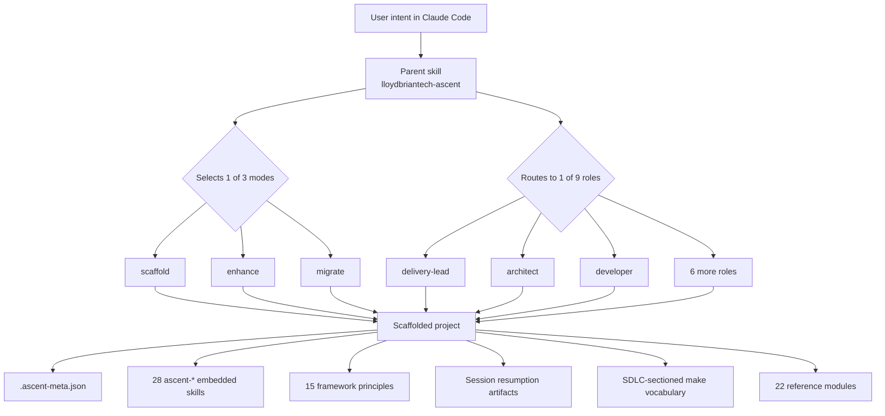

# lloydbriantech-ascent

> An opinionated engineering framework that takes a project from idea to running stack in under two minutes, then keeps it disciplined as it grows.


---

## Why ASCENT

Most engineering frameworks optimize for Day 0 — the scaffold. ASCENT optimizes for **Day 0 through Day 1000**: the long arc where projects accumulate decisions, drift from intent, lose documentation freshness, and silently degrade. The framework is built on the observation that most software quality problems are not problems of skill — they are problems of consistency under fatigue, handoff, and time pressure.

ASCENT codifies hard-won patterns — containerization-first development, make-as-operator-vocabulary, ADR discipline, phase-gated delivery, persona-segmented documentation, session resumption — into a framework where every project starts with these properties and keeps them. The framework itself was built using its own principles: 7 ADRs, phase-gated delivery with explicit go-signals, and cluster-based implementation chunks reviewed before merge. See [`docs/framework/PHILOSOPHY.md`](docs/framework/PHILOSOPHY.md) for the full rationale.

## What you get

A scaffolded ASCENT project ships with all of the following on Day 1:

- **15 enforced principles** — architectural invariants from containerization-first to session resumption ([`PRINCIPLES.md`](docs/framework/PRINCIPLES.md))
- **22 reference modules** — the knowledge base the parent skill consults at runtime (roles, conventions, protocols)
- **28 project-embedded skills** — `ascent-*` skills that keep the project honest as it grows (10 implemented, 18 in progress)
- **Working backend + frontend** — Express + SQLite-WAL + React + Vite, containerized via Podman/Docker
- **SDLC-sectioned make vocabulary** — `make help` as the single operator entry point, 10 `.mk` files across META/DEV/TEST/QA/SEC/VALIDATE/DOCS/INFRA sections
- **7 architectural decision records** — container-first, backend layering, make vocabulary, SQLite-WAL, JSON logging, dual licensing, phase-gated delivery
- **Session resumption protocol** — `session-state.md` + `working-memory.md` so context survives across sessions
- **Working test framework** — Vitest for backend unit tests, bash scripts for skill structural tests, `make test-all` runs everything
- **nginx reverse proxy** — three config variants (dev, prod, dist) with security headers and caching
- **Observability baseline** — pino JSON logging with W3C TraceContext, structured healthchecks (`/healthz` + `/readyz`)

## Quick start

### Option A — Clone the starter (fastest path to a running stack)

```bash
gh repo create lloydbrian/my-new-project \
  --template lloydbrian/lloydbriantech-ascent-starter \
  --private

cd my-new-project

# In Claude Code:
# "Bootstrap this as my-new-project"
# The skill personalizes slugs, applies your option choices, writes .ascent-meta.json

make dev-up
# → http://localhost:3001/healthz responding ✓
```

Total time from `gh repo create` to running dev stack: typically under two minutes.

### Option B — Skill-only (full customization at scaffold time)

```bash
mkdir my-new-project && cd my-new-project

# In Claude Code:
# "Use lloydbriantech-ascent to scaffold this as my-new-project"
# Six-question interview, then full project tree is generated

make dev-up
```

### What the scaffolded project looks like

```
my-new-project/
├── .ascent-meta.json              # Project identity + current phase
├── .claude/skills/ascent-*/       # 28 project-embedded skills
├── backend/                       # Express + SQLite-WAL + Dockerfile
├── frontend/                      # React + Vite + Dockerfile
├── docker-compose.yml             # Dev stack (bind mounts)
├── nginx/                         # Reverse proxy configs
├── Makefile + make/*.mk           # SDLC-sectioned operator vocabulary
├── docs/architecture/decisions/   # 7 ADRs + INDEX.md
├── docs/delivery/                 # Session state + working memory
└── tests/skills/                  # Skill test scripts
```

### Installing the skill itself

```bash
gh repo clone lloydbrian/lloydbriantech-ascent ~/Developer/repositories/lloydbriantech-ascent
cd ~/Developer/repositories/lloydbriantech-ascent
make install
# → Symlinks skills/lloydbriantech-ascent/ into ~/.claude/skills/
```

Run `make uninstall` to remove the symlink. `make help` shows the full operator vocabulary.

## How it works



The parent skill `lloydbriantech-ascent` is a single Claude skill that routes user intent through two axes: **role** (which engineering concern) and **mode** (what kind of operation).

**Nine roles** cover the full project lifecycle: delivery-lead, architect, ui-ux-designer, developer, data-engineer, ai-engineer, tester, devops, and cybersecurity. Each role owns a non-overlapping slice — the architect designs the skeleton, the developer implements features, the devops engineer deploys them. See [`docs/framework/ARCHITECTURE.md`](docs/framework/ARCHITECTURE.md) for the full role taxonomy.

**Three modes** determine the operation type. **Scaffold** creates a greenfield project (no `.ascent-meta.json` present). **Enhance** adds to an existing ASCENT project (`.ascent-meta.json` present). **Migrate** brings a non-ASCENT project up to current standards (explicit `--migrate` flag).

The scaffolded project is self-sustaining: its 28 embedded skills, session resumption protocol, and make vocabulary mean the project can be maintained, audited, and extended without returning to the parent skill.

## The 15 principles

Every ASCENT project enforces these invariants. They are not aspirations — they are conditions that must hold. A project that breaks a principle is either broken or has explicitly superseded it via ADR.

| # | Principle | What it enforces |
|---|---|---|
| §1 | Containerization-first | Dev environment is the container; `make dev-up` from a bare host |
| §2 | Make as operator vocabulary | One `make` target per operation; same name in dev, CI, and runbooks |
| §3 | SDLC-sectioned help | `make help` groups targets by lifecycle stage (DEV, TEST, QA, ...) |
| §4 | Stub-first naming | Future targets ship under their final name from Day 1 |
| §5 | .env discipline | `.env` never committed; `.env.example` with empty defaults only |
| §6 | Strict backend layering | routes → controllers → services → storage; only storage writes |
| §7 | ADR discipline | Every constraining decision gets a five-section ADR |
| §8 | Phase-gated delivery | Numbered phases, explicit exit criteria, literal go-signal |
| §9 | Label-based scoping | All containers, volumes, networks carry the project label |
| §10 | Engine compatibility | `$(ENGINE)` auto-detects Podman/Docker; no hardcoded runtime |
| §11 | Context-aware execution | Skills adapt behavior to current phase and project state |
| §12 | Graceful shutdown | SIGTERM + configurable grace period; no abrupt kills |
| §13 | Dev-status family | `make dev-status` reports container, database, and endpoint state |
| §14 | Persona-segmented docs | Every doc names its audience; 3-click depth limit per persona |
| §15 | Session resumption | Transient state and accumulated decisions persist across sessions |

Full text with rationale: [`docs/framework/PRINCIPLES.md`](docs/framework/PRINCIPLES.md)

## Project-embedded skills

Every scaffolded project ships with **28 project-embedded skills** across two tiers: 14 baseline-deep (full decision trees, ~200-250 lines) and 14 specialized-lean (substantive but less exhaustive, ~100-150 lines). All prefixed `ascent-*`.

**Baseline (14 skills, always scaffolded):**

| Skill | Purpose |
|---|---|
| `ascent-self-audit` | Umbrella audit composing layering, env, and observability checks |
| `ascent-layering-check` | Validates backend import graph (routes → controllers → services → storage) |
| `ascent-env-audit` | Validates .env discipline: gitignored, empty defaults, code-reads match schema |
| `ascent-observability-check` | Validates logger, trace context, healthchecks, lifecycle events |
| `ascent-delivery-status` | Surfaces current phase, exit-criteria progress, recommended next actions |
| `ascent-feature-intake` | Decomposes requests into testable acceptance criteria |
| `ascent-standup` | Summarizes recent activity into standup format |
| `ascent-adr-write` | Guides ADR creation with interview, numbering, INDEX.md update |
| `ascent-doc-stub` | Generates persona-targeted documentation skeletons |
| `ascent-make-target` | Proposes correctly-named make targets with section-aware placement |
| `ascent-reflect` | Captures end-of-session state and decisions |
| `ascent-handoff` | Documents project state for another developer |
| `ascent-onboard` | Guides a new developer through the project |
| `ascent-health` | Aggregates health signals across all health-check skills |

**Specialized and conditional (14 skills):**

`ascent-data-health` · `ascent-doc-sweep` · `ascent-dependency-health` · `ascent-adr-conformance` · `ascent-skills-doctor` · `ascent-qa` · `ascent-release-readiness` · `ascent-security-audit` · `ascent-sec-posture` · `ascent-cost-posture` · `ascent-vitality` · `ascent-ai-evals` · `ascent-design-system-audit` · `ascent-persona-coverage`

**Implementation status:** All 28 skills implemented across 8 clusters per [`docs/framework/PHASE-3-PLAN.md`](docs/framework/PHASE-3-PLAN.md). Each cluster shipped as a reviewed PR with behavior-verifying test scripts. 14 baseline-deep skills (~200-250 lines each) and 14 specialized-lean skills (~100-150 lines each).

## Session resumption

Principle §15 treats session resumption as a first-class engineering concern. Two artifacts persist context across sessions:

- **`docs/delivery/session-state.md`** — transient working state (current focus, next actions, blockers). Gitignored. Captured via `make session-snapshot`, restored via `make session-resume`.
- **`docs/delivery/working-memory.md`** — accumulated decisions, patterns adopted, patterns rejected. Git-tracked. Grows over the project's lifetime.

Skills classify these files using a four-state model (MISSING / EMPTY / STALE / FRESH) and adapt their behavior accordingly. See [`skills/lloydbriantech-ascent/references/session-protocol.md`](skills/lloydbriantech-ascent/references/session-protocol.md) for the full protocol.

## Documentation by persona

ASCENT documentation is segmented by reader. The canonical persona→entry-point mapping lives in [`skills/lloydbriantech-ascent/references/audience-mapping.md`](skills/lloydbriantech-ascent/references/audience-mapping.md). Brief summary:

| Persona | Needs | Entry point |
|---|---|---|
| **Architect** | Mental model, decisions, rationale | `ARCHITECTURE.md` → `DECISIONS/INDEX.md` |
| **Developer** | Backend layering, observability hooks, test conventions | `PHILOSOPHY.md` → `role-developer.md` |
| **Operator** | Make-target catalog, runbooks, healthcheck semantics | `make help` (lands per scaffolded project) |
| **Contributor** | PR conventions, commit format, ADR template, contribution bar | `CONTRIBUTING.md` |
| **Learner** | Why ASCENT, what it provides, where it's heading | `PHILOSOPHY.md` → `ROADMAP.md` |

See `audience-mapping.md` for full per-persona detail — what each doesn't need, path-depth bounds, and how to add new personas.

## Documentation map

| If you want to... | Read |
|---|---|
| Understand the framework's design rationale | [`docs/framework/PHILOSOPHY.md`](docs/framework/PHILOSOPHY.md) |
| See the architectural invariants enumerated | [`docs/framework/PRINCIPLES.md`](docs/framework/PRINCIPLES.md) |
| Know what ASCENT is and isn't for | [`docs/framework/SCOPE.md`](docs/framework/SCOPE.md) |
| See where the framework is heading | [`docs/framework/ROADMAP.md`](docs/framework/ROADMAP.md) |
| Understand the framework's own architecture | [`docs/framework/ARCHITECTURE.md`](docs/framework/ARCHITECTURE.md) |
| Read the framework's architectural decisions | [`docs/framework/DECISIONS/INDEX.md`](docs/framework/DECISIONS/INDEX.md) |
| See the Phase 3 skill implementation plan | [`docs/framework/PHASE-3-PLAN.md`](docs/framework/PHASE-3-PLAN.md) |
| Contribute to the framework | [`CONTRIBUTING.md`](CONTRIBUTING.md) |
| See what changed between versions | [`CHANGELOG.md`](CHANGELOG.md) |

## Status and roadmap

ASCENT has shipped **5 releases** across 4 completed phases:

| Phase | Version | Date | What shipped |
|---|---|---|---|
| Phase 0 — Foundation | v0.1.0-alpha | May 14, 2026 | Repo identity, 7 ADRs, framework docs |
| Phase 1 — Parent skill | v0.2.0 | May 15, 2026 | SKILL.md with routing logic, 22 reference modules, Makefile tree |
| Phase 2 — Template assets | v0.3.0 | May 16, 2026 | Full scaffolded project template, 14-step smoke test |
| v0.3.1 — Session resumption | v0.3.1 | May 17, 2026 | Principle §15, session-protocol.md, make session-snapshot/resume |
| Phase 3 — Skills | v0.4.0 | May 20, 2026 | 28 project-embedded skills, 28 test scripts, 4 architectural patterns |

**Currently:** Phase 3 complete. Phase 4 — Scaffolding scripts — awaiting signal.

**Next:** Phase 4 — Scaffolding scripts (the skill actually writes files). Phase 5 — Test harness with evals. Phase 6 — Starter repo generation. Phase 7 — First production project.

See [`docs/framework/ROADMAP.md`](docs/framework/ROADMAP.md) for exit criteria per phase.

## Who should use this

**Use ASCENT if:**

- You want a project that starts with production-grade conventions on Day 1 (not retrofitted later)
- You value explicit architectural decisions over implicit ones
- You work with Claude Code and want the AI to understand your project's engineering standards
- You want a framework that enforces consistency across session boundaries, developer handoffs, and time pressure

**Don't use ASCENT if:**

- You need a mature, stable framework today — ASCENT is pre-v1.0 and actively evolving
- Your project doesn't use containers (§1 is non-negotiable)
- You want maximum flexibility with minimum opinion — ASCENT is deliberately opinionated
- Your stack is fundamentally different from the baseline (Express + React + SQLite-WAL) and you're not willing to write a migration path

## Contributing

ASCENT is currently a single-author framework (Lloyd D., `lloydbriantech`). Contributions, suggestions, and bug reports are welcome via [GitHub issues](https://github.com/lloydbrian/lloydbriantech-ascent/issues). See [`CONTRIBUTING.md`](CONTRIBUTING.md) for the contribution model, versioning approach, and review bar.

Phase 3 established a cluster-based PR discipline: each cluster of related skills ships as a single reviewed PR with behavior-verifying test scripts, full validator passes, and a review packet before merge. This discipline carries forward for future contributions.

## Support

ASCENT is free and open-source under the MIT/Apache-2.0 dual license. If the framework has saved you time on a project, support is appreciated but never expected:

☕ [buymeacoffee.com/lloydbriantech](https://buymeacoffee.com/lloydbriantech)

## License

Dual-licensed under either of:

- Apache License, Version 2.0 ([`LICENSE-APACHE`](LICENSE-APACHE) or <http://www.apache.org/licenses/LICENSE-2.0>)
- MIT License ([`LICENSE-MIT`](LICENSE-MIT) or <http://opensource.org/licenses/MIT>)

at your option. See [`LICENSE`](LICENSE) for the formal statement.

Unless you explicitly state otherwise, any contribution intentionally submitted for inclusion in this work by you shall be dual-licensed as above, without any additional terms or conditions.

---

*ASCENT is a `lloydbriantech` engineering framework. Built with discipline, in the open.*
